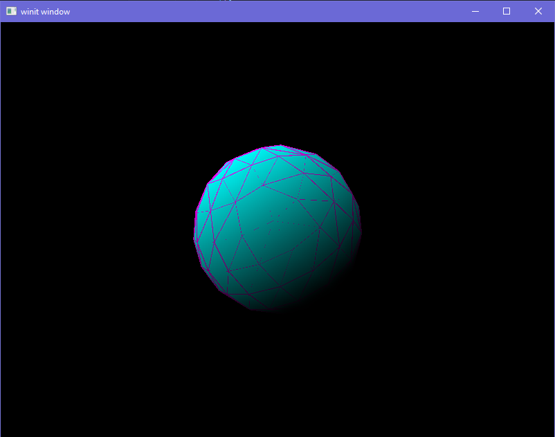

# Planet Simulator 🪐
An interactive 3D solar system simulator built with Rust and modern graphics technologies that accurately models planetary motion using real physics principles.

## Preview



# 🚀 Overview
Planet Simulator is a real-time physics simulation that visualizes our solar system with accurate orbital mechanics. Watch as planets orbit the Sun, moons circle their parent planets, and experience the celestial dance governed by Newton's laws of motion and universal gravitation.

Current Status: Early Development Phase

# ✨ Features
## Current Implementation
+ 3D Graphics Pipeline: Modern rendering using wgpu (WebGPU implementation for Rust)
+ Multi-Scene System: Switch between different test scenes and configurations

## Planned Features
+ Physics Engine: Basic orbital mechanics with gravitational forces
+ Real-time Rendering: Smooth 60 FPS performance with depth buffering and lighting
+ Interactive Camera: Zoom, pan, and rotate around celestial bodies
+ Accurate Scale Models: Realistic planetary sizes and distances (with optional scaling for visibility)
+ Keplerian Orbits: Elliptical orbits with correct orbital periods
+ Moon Systems: Major moons with their own orbital mechanics
+ Time Controls: Pause, speed up, or rewind time
+ Trajectory Prediction: Visualize orbital paths

# 🛠 Technology Stack
Core Technologies
+ Rust - Systems programming language for performance and safety
+ wgpu - Modern graphics API (WebGPU implementation) for cross-platform rendering
+ winit - Window management and event handling
+ glam - Linear algebra library for 3D math
+ bytemuck - Zero-copy serialization for GPU buffers

# 🏗️ Getting Started
## Prerequisites
1. Rust (latest stable version)
2. Vulkan/Metal/DirectX 12 compatible GPU
3. Cargo (Rust package manager)

# Installation
1. Clone the repository:
``` bash
git clone https://github.com/yourusername/planet-simulator.git
cd planet-simulator
```
2. Build and run:
``` bash
cargo run --release
```
3. For development builds:
``` bash
cargo run
```

# 📄 License
This project is licensed under the MIT License - see the LICENSE file for details.